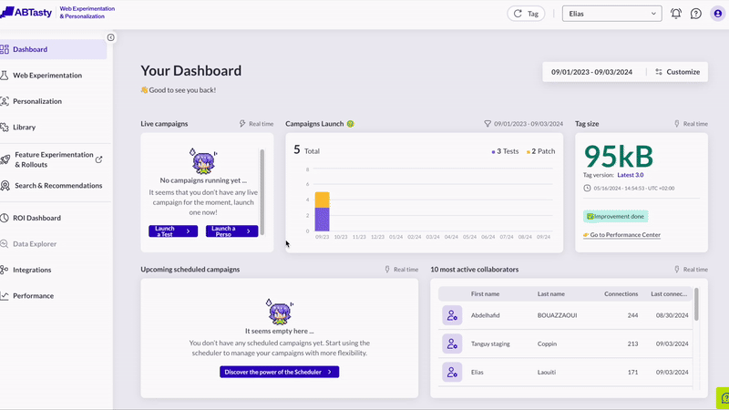
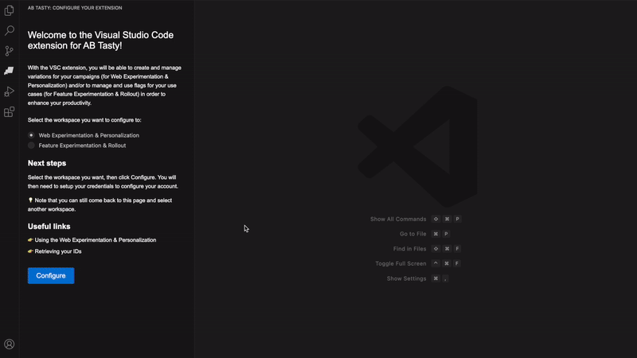
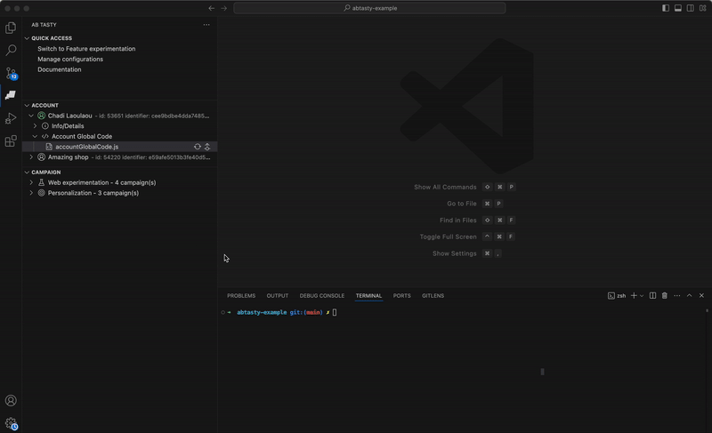
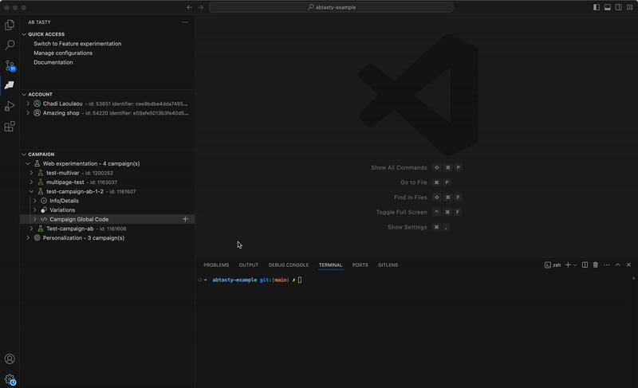
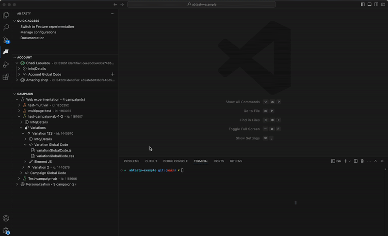
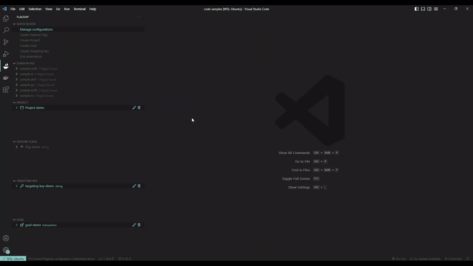
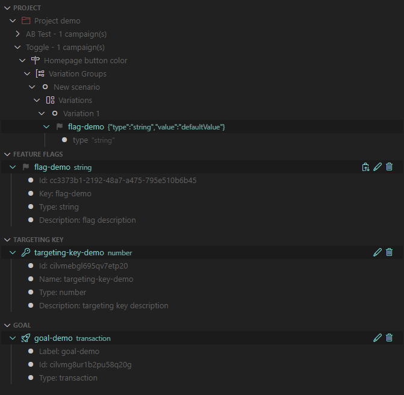
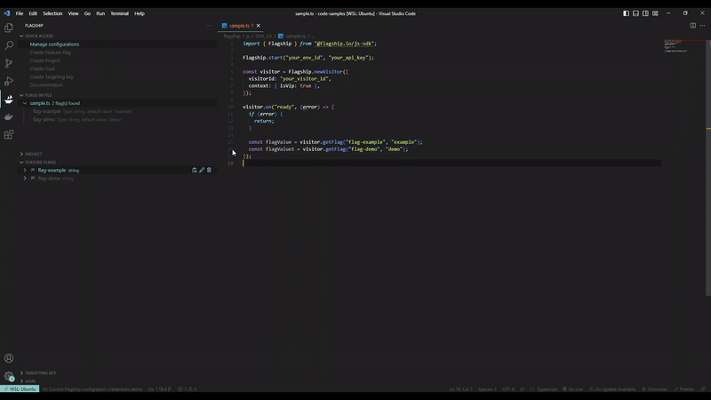
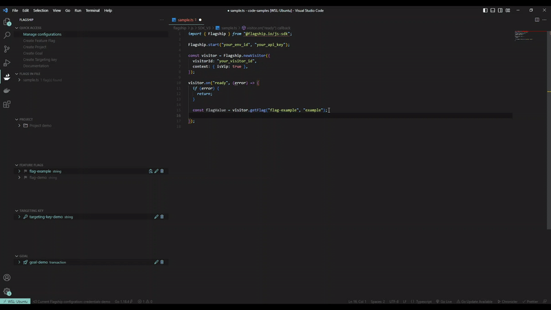
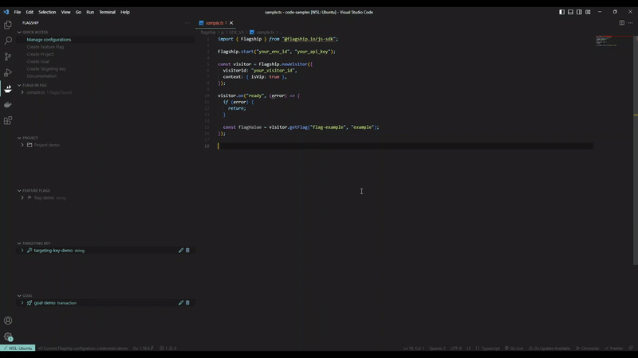

# AB Tasty for Visual Studio Code

#### Disclaimer

> ⚠️ **Beta phase**
>
> Please note that as a beta phase, it may still contain some bugs and imperfections. Your feedback is instrumental in helping us identify and resolve any issues, so don't hesitate to report them by mail product.feedback@abtasty.com or open a ticket issue at [Github issues](https://github.com/flagship-io/abtasty-code/issues)

## Overview

[Web Experimentation & Personalization](https://www.abtasty.com/web-experimentation) provides a range of tools and features designed to help companies improve user engagement, conversion rates, and overall customer satisfaction. This extension is designed to enhance your productivity within the VSCode environment, it offers a comprehensive set of utilities that simplify the management and utilization of campaigns(Tests) and let you handle aspects of campaigns global code directly within VSCode, eliminating the need to switch between your coding environment and the platform.

[Feature Experimentation & Rollout](https://www.abtasty.com/feature-experimentation) optimization platform lets you manage, release, and experiment with features across all codebase and devices to drive growth with every deployment. This extension is designed to enhance your productivity within the VSCode environment, it offers a comprehensive set of utilities that simplify the management and utilization of feature flags using Feature experimentation and let you handle most aspects of feature flag workflows directly within VSCode, eliminating the need to switch between your coding environment and the platform.

## Web experimentation

- Manage your configurations which it a combination of the Web experimentation Client ID, Client Secret, Account ID.

To set up your credentials

To create a configuration:

- Manage Global code for multiple resources such as account, campaign, variation and modification/ElementJS.

For account global code:

For campaign global code:

For variation global code:

For element JS code:

## Feature experimentation

- Manage your configurations which it a combination of the Feature experimentation Client ID, Client Secret, Account ID, Account Environment ID (To set up your credentials follow these [instructions](https://flagship.zendesk.com/hc/en-us/articles/4499017687708--Acting-on-your-account-remotely) or check this [documentation](https://docs.developers.flagship.io/docs/visual-studio-code-abtasty-extension-fe-manage-configurations)).
  To create a configuration:

  

  To change configurations:

  

- Manage your Feature experimentation resources (Project, Feature Flags, Targeting Keys, Goals).

  

- Check feature flags in your files. This feature gives you information on the flags in your current working file and retrieve the flag directly in the code.

  

- Autocomplete for feature flags.

  

- Hover your feature flags.

  

## Documentation

Check out our [documentation](https://docs.developers.flagship.io/docs/visual-studio-code-abtasty-extension) for further explanation.

## Contributors

- Chadi Laoulaou [@Chadiii](https://github.com/chadiii)

## Contributing

We encourage any form of contribution, whether that be issues, comments, or pull requests.

## License

[Apache License.](https://github.com/flagship-io/abtasty-code/blob/main/LICENSE.md)
