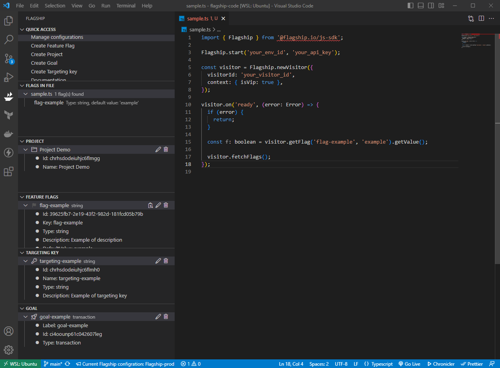
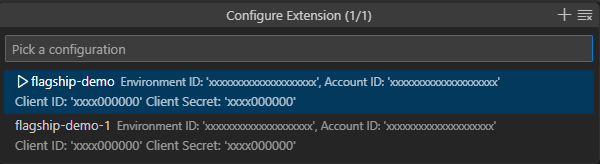
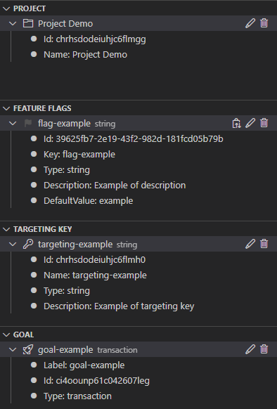
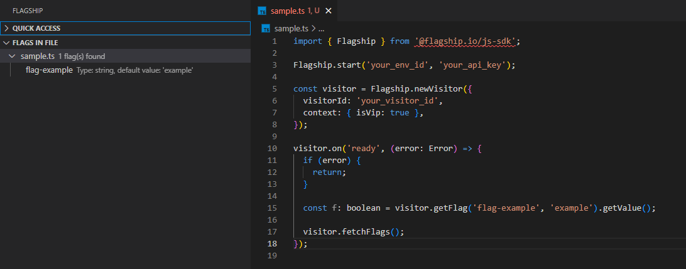
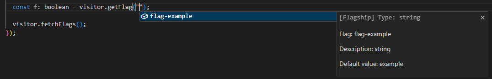
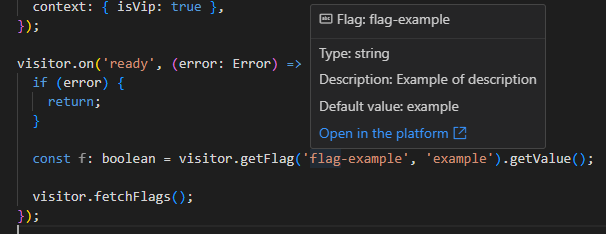

# Flagship for Visual Studio Code

[Flagship](https://www.abtasty.com/feature-experimentation) optimization platform lets you manage, release, and experiment with features across all codebases and devices to drive growth with every deployment. This extension is designed to enhance your productivity within the VSCode environment, it offers a comprehensive set of utilities that simplify the management and utilization of feature flags using Flagship and let you handle most aspects of feature flag workflows directly within VSCode, eliminating the need to switch between your coding environment and the platform.

## Features

- Manage your configurations which it a combination of the Flagship Client ID, Client Secret, Account ID, Account Environment ID (To set up your credentials follow these [instructions](https://flagship.zendesk.com/hc/en-us/articles/4499017687708--Acting-on-your-account-remotely)).

  

- Manage your Flagship resources (Project, Feature Flags, Targeting Keys, Goals).
  
  

- Check feature flags in your files. This feature gives you informations on the flags in your current working file and retrive the flag directly in the code.
 
  

- Autocomplete for feature flags.
  
  

- Hover your feature flags.
  
  

## Contributors

- Chadi Laoulaou [@Chadiii](https://github.com/chadiii)

## Contributing

We encourage any form of contribution, whether that be issues, comments, or pull requests.

## Licence

[Apache License.](https://github.com/flagship-io/flagship-code/blob/main/LICENSE.md)
